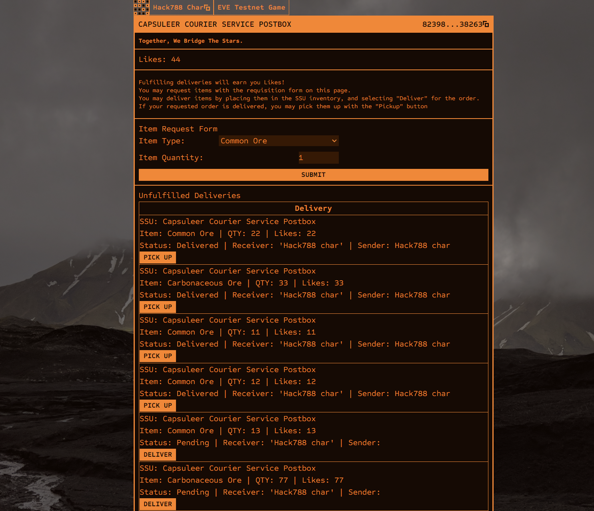

# Capsuleer Courier Service

- Hackathon project

- "Death Stranding in space".
- A Dapp where I can place smart storage units for people to use as drop boxes, like in Death Stranding.
  - perhaps let other people place them as well in the future.
- The Dapp will have a menu to allow users to request items from other players.
- Other players can then fulfill these requests by placing the item in the ephemeral inventory on the SSU, and then submitting the request.
  - I currently do not charge a fee as I haven't written code for it, but a small fee for upkeep could be added.
- the item will move to the SSU inventory, and be ready for pickup.
- The person who makes the delivery will be paid in a custom token called "Likes".
- The person who requested the item will not have to pay anything to pick up their delivered item. It is free.
- Likes can not be spent on anything. they cannot be traded. You keep your likes forever.
- The UI will show a list of items that have been requested.

- This design does not provide any economic benefit. It is purely a social feature designed to encourage positive player interactions.

## Doc links

- vanilla OP Stack L2 chain, with the latest EVM version cancun.
  - https://docs.optimism.io/
- It uses the MUD framework for smart contracts
  - https://mud.dev/introduction
